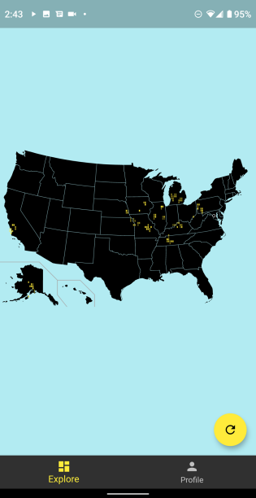
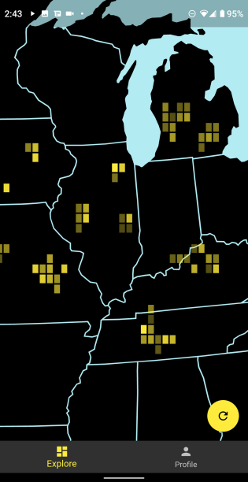

# tangram
A social media app based around location! Users can post videos by location and swipe in 4 directions on a map to navigate the world through videos!

Group Members:
* Albert Li
* Aritro Nandi
* Matthew Pham
* Theodore Li

Tech Stack:
* Flutter - Mobile Frontend written in Dart
* Python - Backend API interfacing with databases
* AWS - Hosts MySQL and Neo4j databases

Databases:
  * Neo4j - Store posts and adjacency relationships for the map
  * MySQL - User data

